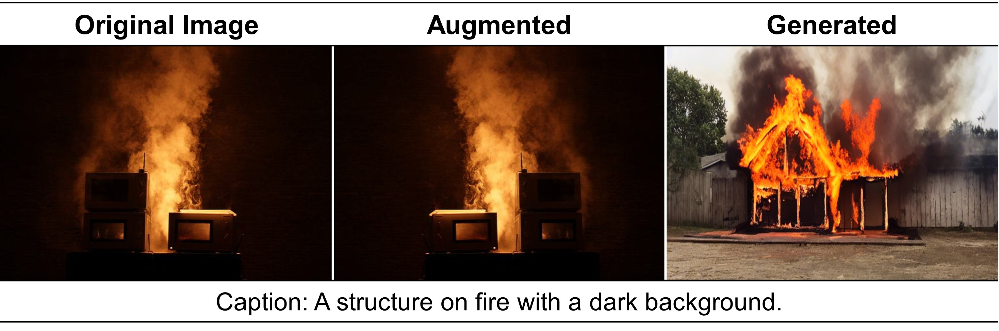
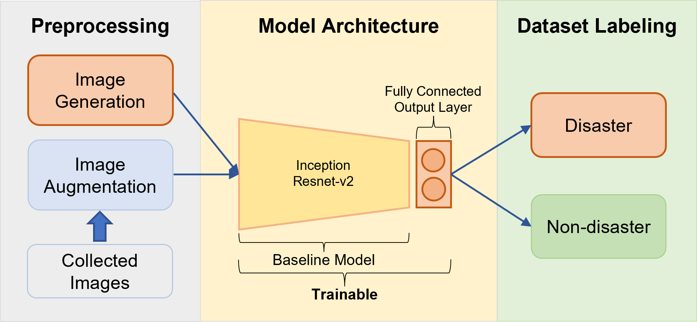

## Disaster Classifier
- Task: **Development of customized disaster media service platform technology for disaster information and vulnerable groups** (재난정보인지 취약계층을 위한 맞춤형 재난미디어 서비스 플랫폼 기술 개발)  
- Task has been completed by **VI Lab [(Video Inteligence Lab)](https://sites.google.com/view/knuvi/)** (~12. 31, 2023) with ETRI (Electronics and Telecommunications Research Institute)
 - *Automatic Classification of Disaster Images Based on Deep Learning* **[[Paper]](https://www.dbpia.co.kr/journal/articleDetail?nodeId=NODE11636493&nodeId=NODE11636493&medaTypeCode=185005&isPDFSizeAllowed=true&locale=ko&articleTitle=Automatic+Classification+of+Disaster+Images+Based+on+Deep+Learning&articleTitleEn=Automatic+Classification+of+Disaster+Images+Based+on+Deep+Learning&language=ko_KR&hasTopBanner=true)** published in KCIS (The Korean Institute of Communications and Information Sciences, 한국통신학회)
 - Patent application (딥러닝 기반 이미지 데이터 분류 장치 및 방법)
- Record Disaster classifier task in Notion [[Link]](https://hojunking.notion.site/Disaster-Task-cb8c0ad55fb44786a558d7874b73f18c?pvs=4)  

### Start
Python 3.9+  
```
pytorch torchvision torchaudio pytorch-cuda=12.1 -c pytorch-nightly -c nvidia
conda install pandas, numpy, tqdm, timm, albumentation
```
- Prepare dataset (disaster or non-disaster images)
- Train, Evaluation code : ``train.py, eval.py``
- Classifier model (inception_resnet-v2) **[[Google drive]](https://drive.google.com/drive/folders/1OhiCNBPpkISCRuQ-8G0Z-HE5Kk9LAUx5?usp=sharing)**

### Proposed Method
- **Augment disaster images**  

      

- **Framework**  

    